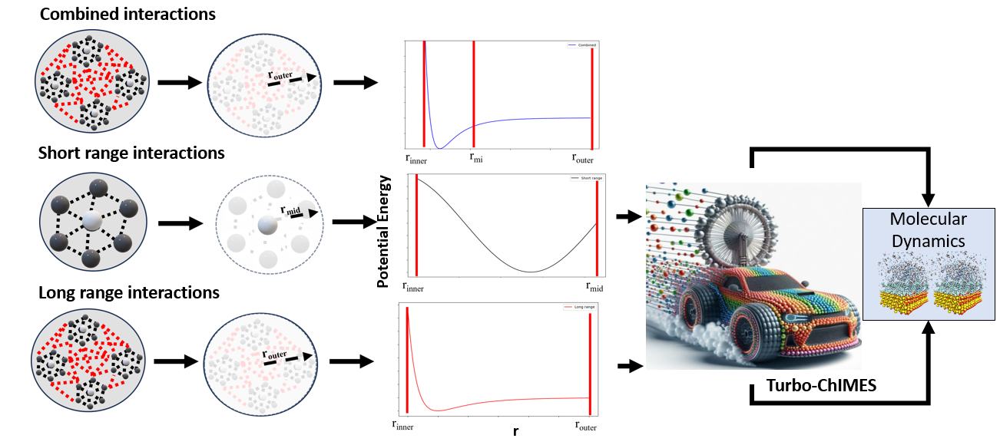
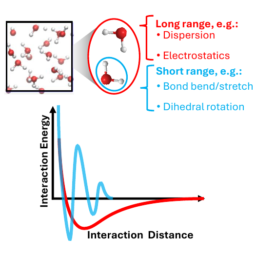

.. _page-turboChimes:

***************************************
Multilayer (TurboChIMES) Fitting Mode
***************************************

   **Fig. 1.** Schematic of the TurboChIMES / multilayer idea: short-ranged interactions are represented with a dense Chebyshev basis (bond rearrangements, steep repulsion), while long-ranged contributions use a sparser basis that varies more smoothly.

This page documents the multilayer ChIMES (TurboChIMES) workflow as implemented in the Active Learning Driver (ALD).

   **Fig. 2.** Short- vs. long-range resolution in the multilayer construction (rasterized from the manuscript figure; vector PDF also available).

A vector version is still provided for slides or print: :download:`short_and_long_range_description.pdf <short_and_long_range_description.pdf>`.

-------

====================================
Motivation and mathematical overview
====================================

Machine learned interatomic potential (ML-IAP) generally endeavors to fit all of these interactions at once, in a single unified model. Consequently, necessary basis set completeness has been governed by featuredness of short-range/bonded interactions, while interaction range has been governed by relatively smooth mid-to-long-range/non-bonded interactions. However, these systems could be more efficiently described by simultaneously learning two overlaid ML-IAP; one that is short ranged and described through many basis functions, and another that is relatively longer ranged and requires fewer. The result would be models that exhibit the same accuracy as those developed through the single-layer strategy, while exhibiting greater computational efficiency due to the lower overall number of basis functions needed. This page details how this strategy is realized within the context of the ChIMES ML-IAP workflow in the Active Learning Driver. For the method and benchmarks, see the multilayer ChIMES manuscript `(link forthcoming) <https://arxiv.org/abs/TBD>`_.

Two-layer construction (short + long). The user specifies ChIMES hyperparameters independently for each layer: in particular, maximum bodiedness, maximum polynomial orders (:math:`\mathcal{O}_{n\mathrm{B}}`), and outer cutoffs :math:`r_{\mathrm{cut}}`. ChIMES LSQ then builds a design matrix per layer, :math:`\mathbf{M}_{\mathrm{short}}` and :math:`\mathbf{M}_{\mathrm{long}}`, with the same number of rows (one per constraint row derived from the reference data :math:`\mathbf{X}_{\mathrm{DFT}}`) but different numbers of columns when the two layers use different bodiedness / polynomial orders. The matrices are concatenated horizontally and the combined linear system is solved in weighted least-squares form:

.. math::
   :label: eq-turbo-design

   \mathbf{w}
   \left[\mathbf{M}_{\mathrm{short}}\ \mathbf{M}_{\mathrm{long}}\right]
   \begin{bmatrix}
   \mathbf{c}_{\mathrm{short}} \\ \mathbf{c}_{\mathrm{long}}
   \end{bmatrix}
   =
   \mathbf{w}\,\mathbf{X}_{\mathrm{DFT}}

Here :math:`\mathbf{w}` denotes the usual weighting of rows (forces, energies, stresses, etc., as in standard ChIMES LSQ). The coefficient blocks :math:`\mathbf{c}_{\mathrm{short}}` and :math:`\mathbf{c}_{\mathrm{long}}` are the separate parameters for the short- and long-ranged layers. At run time, LAMMPS evaluates the two ChIMES pair contributions and combines them (e.g. via ``hybrid/overlay`` style pair interactions), as produced by the ALD/ChIMES tool chain.

-------

============================
Example fit: Propane system
============================

.. Note::

   Example files live under:

   ``<al_driver repository>/examples/simple_iter_single_statepoint-lmp-test-turbo-test``

The bundled propane example is for united-atom fit for liquid propane. The force field defines two carbon types, ``C1`` (terminal methyl carbons) and ``C2`` (central methylene carbon), so bonded and non-bonded pair rows in ``fm_setup.in`` can be assigned separately. Layer ``0`` is tuned for short-ranged intramolecular structure (bonded geometry and stiff repulsion within each propane molecule); layer ``1`` carries longer-ranged intermolecular van der Waals interactions between molecules in the periodic box. Reference data for this bundled example use LAMMPS as the “QM” reference method (``BULK_QM_METHOD = "LMP"``), so you must supply both ChIMES MD templates and classical reference LAMMPS inputs (see below).

------------------------------------------
Directory layout (relative to the example)
------------------------------------------

Compared with :ref:`page-basic`, the ``ALC-0_BASEFILES`` area contains two numbered setup files instead of a single ``fm_setup.in``. The ``LMPMD_BASEFILES`` and ``LMP_BASEFILES`` directories supply ChIMES fitting MD and reference LAMMPS jobs, respectively.

.. code-block:: text
   :emphasize-lines: 4,14-16

   ALL_BASE_FILES/
   ├── ALC-0_BASEFILES/
   │   ├── 0.fm_setup.in          # short-range hyperparameters / cutoffs
   │   ├── 1.fm_setup.in          # long-range hyperparameters / cutoffs
   │   ├── test_data.xyzf
   │   └── traj_list.dat
   ├── LMP_BASEFILES/
   │   ├── 1.data.in
   │   └── 1.in.lammps
   └── LMPMD_BASEFILES/
       ├── bonds.dat
       ├── case-0.indep-0.data.in
       ├── case-0.indep-0.in.lammps
       └── case-0.skip.dat

Role of ``0.fm_setup.in`` vs. ``1.fm_setup.in``. Layer ``0`` encodes the short-ranged ChIMES model (typically smaller outer cutoffs and/or higher polynomial orders where the potential is stiff). Layer ``1`` encodes the long-ranged model (larger cutoffs and a sparser Chebyshev expansion where the potential is smoother). Your exact hyperparameter lines must be self-consistent with the ChIMES LSQ manual and the physical system.

``N_HYPER_SETS`` in ``config.py`` must equal the number of numbered ``*.fm_setup.in`` files in ``ALC-0_BASEFILES`` (2 in this example). The driver copies ``0.fm_setup.in``, ``1.fm_setup.in``, and so on into each ChIMES LSQ build, assembles one design matrix per file from the same ``traj_list.dat`` / ``*.xyzf`` training data, and expects one reduced parameter file per layer after regression (``0params.txt.reduced``, ``1params.txt.reduced``, …). Set ``N_HYPER_SETS = 1`` only for single-layer/standard ChIMES fits documented on :ref:`page-basic` or :ref:`page-hierarch`; multilayer TurboChIMES is not selected in that case.

Multilayer fitting does not use hierarchical options such as ``DO_HIERARCH`` or ``HIERARCH_PARAM_FILES``.

ChIMES LSQ options in each ``fm_setup.in``. The two layers share the same training trajectory (``# TRJFILE #``), frame count (``# NFRAMES #``), atom-type table (``# TYPEIDX #`` / ``# NATMTYP #``), and three-body exclusion list. They differ in the Chebyshev polynomial orders and cutoffs that define each layer’s resolution:

* ``# PAIRTYP #`` — ``CHEBYSHEV`` followed by maximum 2-, 3-, and 4-body polynomial orders (:math:`\mathcal{O}_{n\mathrm{B}}`; remember that orders :math:`\geq 3` are entered as :math:`n+1` in ``fm_setup.in``, as in :ref:`page-basic`).
* ``# PAIRIDX #`` — pair-specific inner and outer cutoffs (``S_MINIM``, ``S_MAXIM``), grid spacing (``S_DELTA``), and Morse parameters for each atom-type combination.
* ``# FCUTTYP #`` — inner cutoff functional form (Tersoff-style in the example).

In the bundled propane files, layer ``0`` uses ``CHEBYSHEV 6 6 0`` with ``S_MAXIM`` of 2.75 Å on all pair rows, while layer ``1`` uses ``CHEBYSHEV 4 0 0`` with ``S_MAXIM`` of 7.0 Å. The ``# NLAYERS #`` line in each file is the standard ChIMES LSQ control variable (here ``1`` per file) and is not the same as the driver’s multilayer count; do not confuse it with ``N_HYPER_SETS``.

For remaining ``fm_setup.in`` fields (weights, stress/energy fitting flags, Coulomb options, etc.), follow the `ChIMES LSQ manual <https://chimes-lsq.readthedocs.io/en/latest/index.html>`_ and keep both layer files consistent except where you intentionally change resolution or cutoffs.

-------

------------------------------------------
Input files and ``config.py``
------------------------------------------

~~~~~~~~~~~~~~~~~~~~~~~~~~~~~~~~
Key ALD settings
~~~~~~~~~~~~~~~~~~~~~~~~~~~~~~~~

Set ``N_HYPER_SETS`` to the number of independent ``*.fm_setup.in`` layers you intend to fit (2 for the standard short + long propane example). The ALD then builds, solves, and post-processes that many layer-specific design matrices and parameter files on every fitting cycle.

LAMMPS is required for MD in the Turbo workflow as shipped: the fitted potential is expressed as two ChIMES pair styles that LAMMPS combines (e.g. ``hybrid/overlay``). The example ``case-0.indep-0.in.lammps`` declares one ``chimesFF`` instance per layer and maps them to ``0params.txt.reduced`` and ``1params.txt.reduced``.

A minimal excerpt from the example ``config.py`` (compare full file in the example directory):

.. code-block:: python
   :linenos:
   :emphasize-lines: 26-27

   ################################
   ##### General variables
   ################################

   ATOM_TYPES = ['C']
   NO_CASES = 1

   DRIVER_DIR     = "/path/to/al_driver/src/"
   WORKING_DIR    = "/path/to/examples/simple_iter_single_statepoint-lmp-test-turbo-test/"
   CHIMES_SRCDIR  = "/path/to/chimes_lsq/src/"

   ################################
   ##### ChIMES LSQ
   ################################

   ALC0_FILES    = WORKING_DIR + "ALL_BASE_FILES/ALC-0_BASEFILES/"
   CHIMES_LSQ    = CHIMES_SRCDIR + "../build/chimes_lsq"
   CHIMES_SOLVER = CHIMES_SRCDIR + "../build/chimes_lsq.py"
   CHIMES_POSTPRC= CHIMES_SRCDIR + "../build/post_proc_chimes_lsq.py"

   WEIGHTS_FORCE = 1.0
   REGRESS_ALG   = "dlasso"
   REGRESS_VAR   = "1.0E-5"
   REGRESS_NRM   = True
   N_HYPER_SETS  = 2

   ################################
   ##### Molecular Dynamics
   ################################

   MD_STYLE        = "LMP"
   MDFILES         = WORKING_DIR + "/ALL_BASE_FILES/LMPMD_BASEFILES/"
   MD_MPI          = "/path/to/lmp_mpi_chimes"
   CHIMES_MD_MPI   = MD_MPI
   MOLANAL         = CHIMES_SRCDIR + "../contrib/molanal/src/"
   MOLANAL_SPECIES = ["C1"]

   ################################
   ##### Single-point "QM" (LAMMPS reference)
   ################################

   BULK_QM_METHOD  = "LMP"
   IGAS_QM_METHOD  = "LMP"
   QM_FILES        = WORKING_DIR + "ALL_BASE_FILES/LMP_BASEFILES"
   LMP_EXE         = "/path/to/lmp_mpi_chimes"   # must support class2 / molecular reference inputs
   LMP_UNITS       = "REAL"

Replace all paths, queues, modules, and account settings with those appropriate for your HPC environment. The reference LAMMPS job in ``LMP_BASEFILES`` uses molecular atom styles and class2 angles in the bundled example; your ``LMP_EXE`` must be built with compatible packages (see :ref:`page-basic` LAMMPS discussion where applicable).

-------

------------------------------------------
Running and inspecting output
------------------------------------------

The execution pattern matches :ref:`page-basic`:

1. Edit ``config.py`` and all paths under ``ALL_BASE_FILES/``.
2. From ``WORKING_DIR``, run the driver, e.g. ``python3 /path/to/al_driver/src/main.py 0 1 2 3`` (or your site’s wrapper), preferably inside ``screen`` or ``tmux``.

Inspect ChIMES LSQ logs, fitted parameter files for both layers, and subsequent LAMMPS trajectories as you would for a single-layer fit. If regression fails or weights are imbalanced, revisit ``WEIGHTS_*``, ``REGRESS_VAR``, and the hyperparameters in ``0.fm_setup.in`` / ``1.fm_setup.in``.

-------

========================================================
Further reading and cross-links
========================================================

* ChIMES LSQ manual: `ChIMES LSQ documentation <https://chimes-lsq.readthedocs.io/en/latest/index.html>`_.
* LAMMPS ``hybrid/overlay`` with multiple ``chimesFF`` layers: see the ChIMES calculator documentation for your build.
* Single-layer baseline workflow: :ref:`page-basic`.
